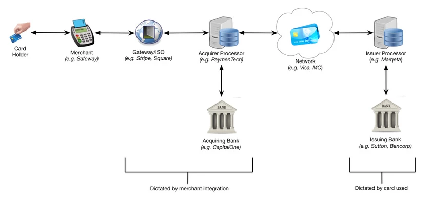

# Marqeta

## Onboarding

-   [New hire orientation presentation](https://docs.google.com/presentation/d/1MWLebfNr-Qw88Q59c9S56B2GIiyNnpdqur8dn2Hu4Ug/edit?usp=sharing)
-   [IT computer setup presentation](https://docs.google.com/presentation/d/1PAjsSTnLv5wgFpVyOoH_U1iqRQQQ4TujL0Z_qj4JICQ/edit?usp=sharing)
-   [HR benefits presentation](https://docs.google.com/presentation/d/1pWY3OxuK5mm-yBKPt5DhDEITYZQEGAdts0o50VE04Q0/edit?usp=sharing)
-   See pinned messages in Slack #helpdesk channel for more setup/onboarding processes.
-   [New hire orientation checklist](https://docs.google.com/document/d/1v1v7aG1FAPN01kUvfX6og7oTwUx_viajd_8Te6xG4qw/edit?usp=sharing)

## Understanding Marqeta

Marqeta is:

1. An **Issuer Processor**
    - Issues payment cards (virtual, tokenized, and physical) on behalf of banks and processes transactions.
    - Our platform is designed to offer a broad feature set that can support wide range of use cases from many different kinds of companies.
2. A **Program Manager**
    - Manages most of the challengings parts about launching card programs.
    - Defines the program, marets to consumers and merchants, operates the program, and manages its profitability.
    - Complies with payment network rules and regulations.

### Marqeta Products

1. Core APIs: Allows customers to issue payments cards and customize card behavior, which allows them to create users, distribute cards, fund accounts, and control spending.
2. DiVA (Data Insights Visualization and Analytics) APIs: Enables data-driven decisions for ourselves and customers by aggregating and curating production data. This allows us to review spending, filter data, and explore insights.
3. Card issuing: Physical cards, virtual cards, tokenized cards, funding options (standing funding or JIT funding).
4. Program Dashboard: Allows banks and customers to review the status of their card "program", make changes to how it works, and review funding history.
5. Marqeta.js: JS library that presents virtual card information to the card holder. This reduces compliance burden for customers by storing sensitive cardholder data on our servers.
6. Digital Wallet SDKs: Guide customers through the process of integrating their system with their digital wallet API and the Marqeta API.
7. IVR (Interactive Voice Response): Allows customers to set up a phone number which allows users to report their card lost or stolen, check their account balance, activate their card, and set their PIN.
8. PCI Widgets: Gives customers who aren't PCI certified to use widgets on their website which allow consumers to activate their card and setup a PIN.
9. DiVA app: Interna/external app which allows users to review current reporting, inspect historical data journals, schedule reports, and tag and make decisions on specific cardholder accounts.
10. Monterey (internal): Allows internal teams to get customer card programs up and running on Marqeta's platform. Through it we can manage program configuration, chargeback management, card fulfillment, authentication management, and reporting.

## Health Insurance

-   How to [find a provider][1] outside of CA

## Product Vision

-   [Refactor 2019](https://docs.google.com/presentation/d/1-w_m1fbpS4nC-AdKDnBM1mJN6hhj8zc9MCIzEcs8KUA/)

[1]: ./assets/Blue%20Shield%20-%20Find%20a%20Doctor.pdf "Blue Shield - Find a Doctor"

## WAM local dev environment initial setup

1. Set up `wam-docker` repo:

    1. [Install `docker` and `docker-compose`](https://www.docker.com/docker-mac).
    2. Clone [`wam-docker`](https://github.marqeta.com/marqeta/wam-docker).

2. Set up `wam` repo:

    1. Install nvm via homebrew (`brew install nvm`) or [manually](https://github.com/nvm-sh/nvm).
    2. Install the version of node that Drone and AWS uses (`8.10`).
    3. Clone [`wam` repo](https://github.marqeta.com/marqeta/wam).

3. Set up and run [GraphQL](https://github.marqeta.com/marqeta/wam/blob/develop/apps/graphql/README.md#set-up).

4. Set up and run [SSO/DiVA](https://github.marqeta.com/marqeta/wam/blob/develop/apps/diva/README.md).

5. Navigate to [https://localhost:3000](https://localhost:3000) and sign in.

### Common development workflow

-   For SSO and DiVA: cd to directory and `npm run start` (in DiVA also `npm run watch`)

### Questions

1. [`wam` readme pre-setup](https://github.marqeta.com/marqeta/wam#pre-setup) says to install webpack. Why is this a manual step? Shouldn't webpack be installed as a devDependency?

2. The [`wam` readme](https://github.marqeta.com/marqeta/wam#how-to-use-the-monorepo) has a section for using lerna to work with the monorepo. It suggests running `lerna bootstrap` to "get everything all installed and connected", but later [lists `npm run sbs` as step one of the setup process](https://github.marqeta.com/marqeta/wam#setup) (which seemingly also runs `lerna bootstrap`). Why are both documented? When would I run `lerna bootstrap` and not `npm run sbs`? Is the "How to use the monorepo" section necessary? When would I run those commands vs the others?

3. What is your typical workflow for running locally and making changes?

    - Which DiVA app command should I typically run of the three that are documented?

4. The FDS onboarding docs has a section for dev environment setup, which consists of [setting up a local JCard environment](https://marqeta.atlassian.net/wiki/spaces/~ckimmel/pages/505643770/Setup+a+local+JCard+environment+IntelliJ+IDEA), setting up [`credit-api`](https://github.marqeta.com/marqeta/credit-api), and setting up [`starterkit`](https://github.marqeta.com/marqeta/starterkit). Do I need these (I assume they are mostly used by back end folks)? **NOTE: FDS onboarding doc should be updated to reflect front/back end specific setup tasks.**
