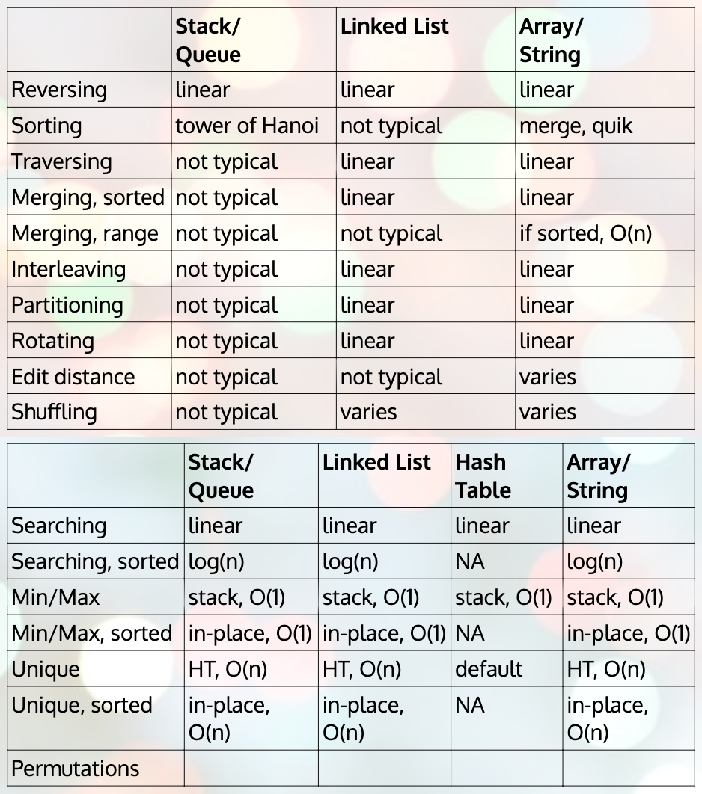
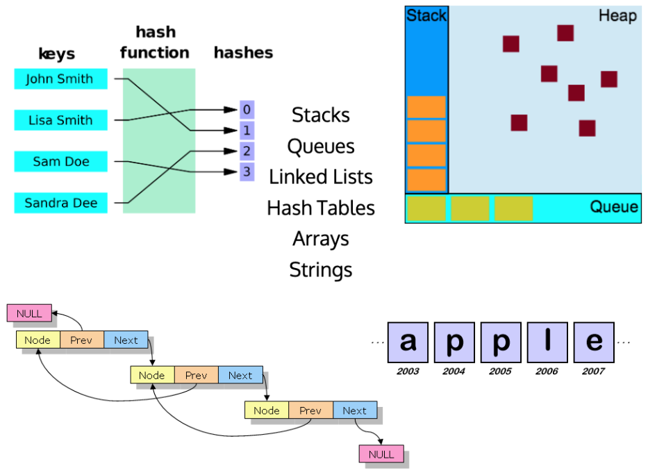
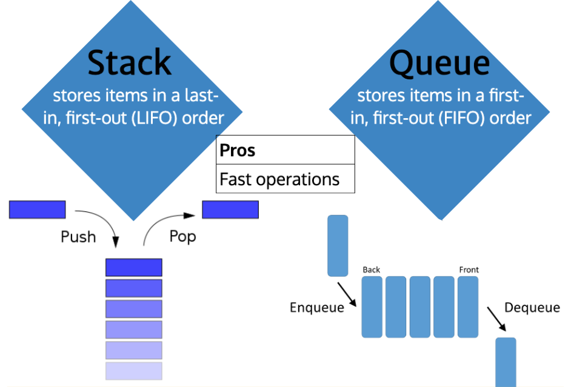
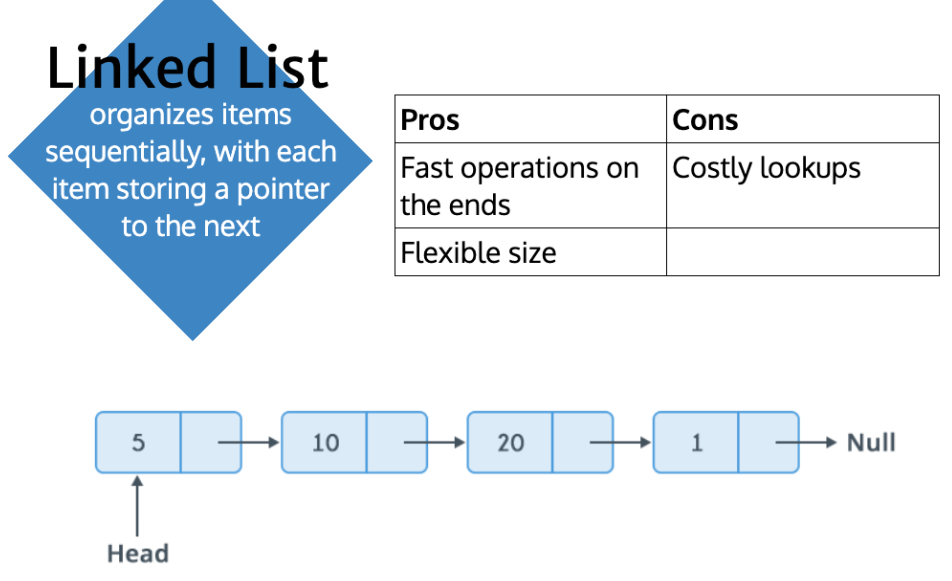
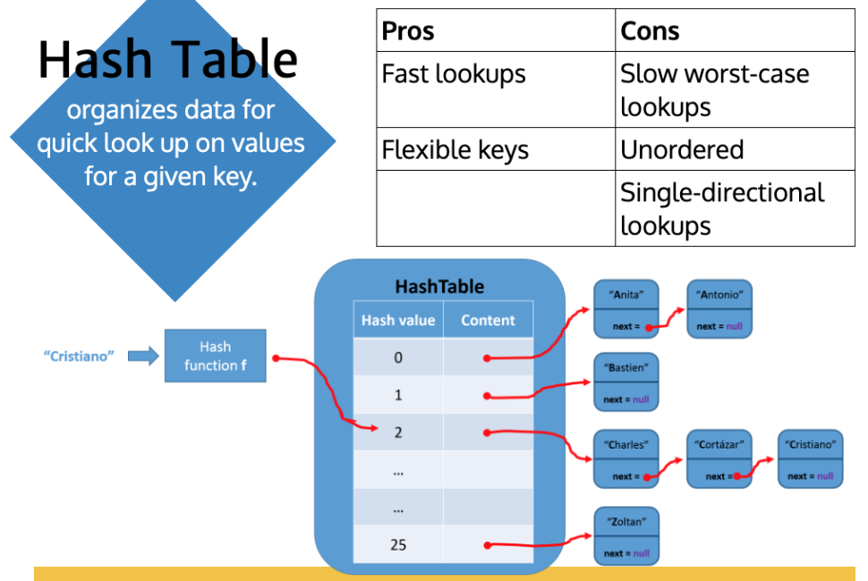
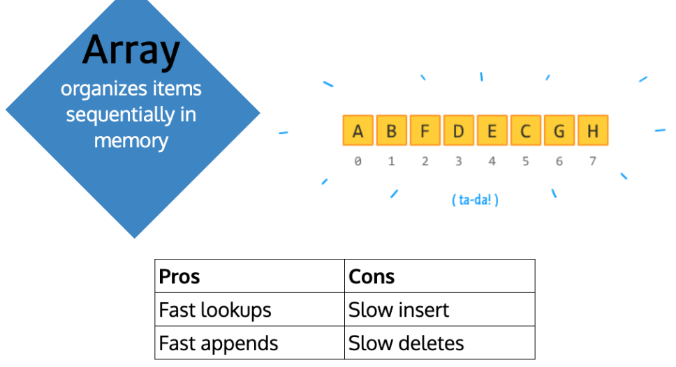

# Data Structures

[Data structure cheatsheet](https://www.bigocheatsheet.com/)

## Types of data structures

-   Stacks
-   Queues
-   Linked lists
-   Hash tables
-   Arrays
-   Strings

## Stacks and Queues

- 
- [Stack visual aid](https://visualgo.net/en/list?slide=4)
- [Stack class example](./code/stack.js)
- [Queue visual aid](https://visualgo.net/en/list?slide=5)
- [Queue class example](./code/queue.js)

Both are ordered data structures.

-   _Stack:_ Stores items in a last-in, first-out order (LIFO).
-   _Queue:_ Stores items in a first-in, first-out order (FIFO).

### Applications

Stacks:

- Undo/redo feature of text editors.
- Back/forward feature of browser.
- Reversing order (e.g., of a string).
- Testing symmetry.

Queues:

- People at a ticket window.
- Vehicles on a toll bridge.
- Event queues.
- Buffers.

### Pros

-   Fast/performance

## Linked Lists

- 
- [Linked List visual aid](https://visualgo.net/en/list?slide=3)
- [Linked list sample class](./code/linked-list.js)

_Linked Lists_ organizes items sequentially, with each item storing a 
pointer to other items (e.g., next/previous items). Linked lists are often
the underlying data structure for a stack or a queue.

### Applications

- Browser history.
- Least recently used (LRU) cache.

### Pros

- Fast operations on the ends.
- Flexible size.

### Cons

- Costly lookups/searches.

## Hash Tables

- 
- [Hash Table sample class](./code/hash-list.js)

_Hash Tables_ are not ordered. They organize data for quick look up on
values for a given key.

### Applications

- Any time you need to look something up quickly.

### Pros

- Fast lookups.
- Flexible keys.

### Cons

- Slow worst-case lookups.
- Unordered.
- Single-directional lookups.

## Arrays

_Arrays_ organize items sequentially in memory.

### Pros

- Fast lookups.
- Fast appends.

### Cons

- Slow insert.
- Slow deletes.

